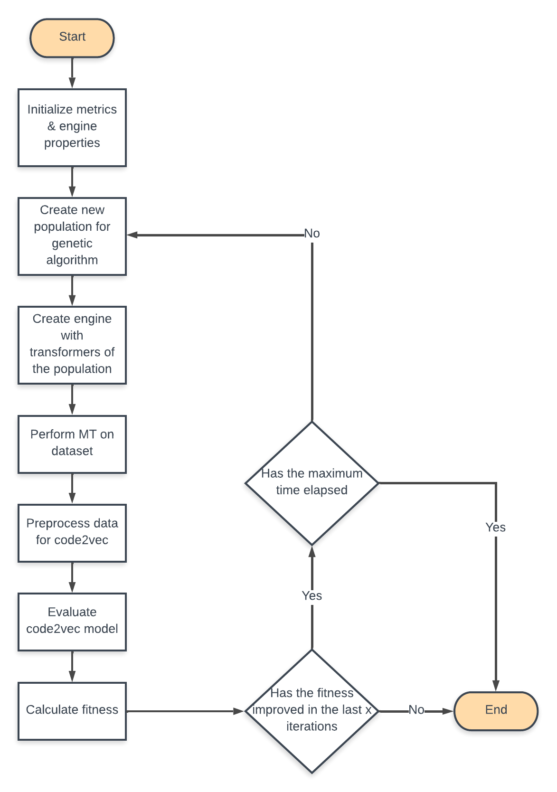

# Guided-MT-Code2vec
This repository works with genetic programming to optimize metrics for code2vec method name prediction.
The architecture for this is depicted in the image below.


This project is part of my master thesis and is still under development.
I intend to actively maintain the project during the course of the master thesis which is until 01-09-2022.
Before this date you can create an issue, and I will get back to you with an answer within the week.
If you need to reach me after this date for questions about the project you can reach me at rmar@live.nl, and I will get back to you asap.

## Problem introduction
Method name prediction has been researched for over twenty years. The goal was to have a model that was able to accurately predict method names. 
With this, we would gain the ability to create a tool that can suggest method names to software developers, 
which would assist in improving the quality of the projects. Prior works have looked into the robustness of trained code2vec models, like the work 
by Compton et al. on the generalizability of these code2vec models by obfuscating identifier names.
Changing identifier names is a change that does not change the semantics of the code but does change the appearance. 
More changes do a similar job that is called metamorphic transformations. It is interesting to see what the impact of multiple of these metamorphic 
transformations is on the performance of the trained code2vec model.

The goal is to assess the robustness of trained code2vec models using guided metamorphic testing. The question this thesis tries to answer is to 
what extent the performance metrics are affected by applying metamorphic transformations to the test set of a trained code2vec model. 
Besides this, this thesis also proposes an alternative metric that might better reflect the robustness of a model.

## Getting started
In this project recursive repositories are used. This means that before you try to build the project you should clone both the repositories.
For this simple run the following command in your git bash:

```sh
git clone --recursive -j8 https://github.com/wubero/Guided-MT-Code2Vec.git
```

## Build & Run

To build the project, simply do:

```sh
mvn clean package verify
```

To build an executable:

```sh
mvn package verify
```

### Docker
If you run the project via docker you do not need to install anything yourself.

## Running Guided-MT-Code2Vec

It's highly recommended that new users start by looking at both other projects that are used here, code2vec and Lampion.
Code2Vec is used for evaluating its trained model, besides that the Lampion project is used for the Java metamorphic transformers.

To get started with the project you

1. Download a trained code2vec model
2. Adjust paths and dataset names in preprocess.sh
3. Adjust paths and dataset in PipelineSupport.java
4. As a dataset you can you use the provided one in ./code2vec/data, or you can download your own. (The next sections describes how this projects got its test datasets.)
5. If you do download your own dataset there might occur errors with the spoon library. These can be resolved by running the EditData.py script

## Dataset

For the datasets used in our experiments we randomly selected 30 from the java-small dataset provided by code2vec
through the following link: 

```sh
wget https://s3.amazonaws.com/code2vec/data/java-small_data.tar.gz
```

As mentioned the dataset we used is provided in ./code2vec/data. However, you can also generate your own random dataset
by executing the file_picker.sh script located in ./scripts. To do this only the directory and target paths need to be changed.

## Requirements

- Maven
- Jdk 17
- Python 3.9

## Troubleshooting
If the bash commands in the program are not working you might need to adjust the file endings of 
the shell scripts in the code2vec folder. You can do this by running the dos2unix command in 
something like git bash. This will readjust the file endings and make sure that the docker build 
runs smoothly.

### Known problems
If the project doesn't work consider any of the problems below before opening an issue on GitHub.

1. Code2vec is missing from the repository because it wasn't cloned recursively.
2. The Lampion core is missing. If you're running it locally it might mean that you don't have it build with the correct version or don't have it 
   locally at all. To fix this, clone the Lampion repository and build it with the correct version. This should fix the problem.

## Experiments
There are two experiment folders for this project. These are the Experiments and Experiments_random folders. The Experiments folder uses the 
genetic algorithm and runs its respective configurations on it. The Experiments_random folder does the same with the random algorithm. There is a 
README.md in the Experiments folder that explains how to further run the experiments.

The experiments are designed to answer the problem mentioned in the problem introduction. The genetic algorithm and random algorithm are compared 
with each other through these experiments. 

### Scripts
The scripts folder is used to pick the files for the dataset, as mentioned above under Dataset. It also has a python file that parses the 
experiments to csv files and creates the plots used in the thesis. There are multiple method in there with comments above for what they do. You 
can comment out the respective methods if you don't want them to run.
