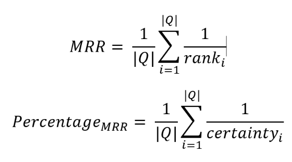

# Architecture
This file holds some considerations for the implementation details that occurred throughout the project.

## Project structure
If you are looking to add to this project you will want to start from the Main file. Here the program kicks off,
and you can see the flow of the program.
If you want to add a metric it needs to extend the abstract metric class and be added to either the MetricCategory if
it follows the normal objective of the program or to the secondary metrics if it does not need to be included in the
fitness function.
If you want to adjust the genetic algorithm or add to the existing one you should look at the simpleGA folder and work
from there.
All support classes can be found in the support folder.

## The Lampion project
The Guided-MT-Code2Vec project uses the transformers from the [Lampion project](https://github.com/ciselab/Lampion).
For an explanation on how the transformers work and how to use them in your own projects look at their GitHub.
I chose the transformers that are defined in the Lampion project because it has great documentation where to find what
and has a branch where the transformers and engine are split from the rest of the project.
This means I could import this part on its own without having to import and build the rest.
If you also want to create your own transformer or learn more about the existing transformer please look at the Lampion repository.

## Code2Vec
I decided to use the code2vec models through command line commands instead of adjusting the code 
to have different inputs. Code2vec preprocesses and evaluates the model through these commands. 
I did this for easy debugging and logging through the result files. There were however some 
basic changes made for logging different results such as certainty of a prediction so that I can 
use this for the metrics. The code2vec commands are executed in the GenotypeSupport class 
through bash.

## Genetic search
In this project I made the decision to create a custom genetic search algorithm instead of using a library for this.
All libraries I looked at did not support variable length for the genotypes. 
In our program, I need to mutate the individuals and increase the number of transformers I use in every generation. 
I also want the opportunity to use transformers twice or even three times. All the libraries I looked at did not support this option. 
The only options they gave that came close Ire a subset of permutation. 
The subset entails that the program will evaluate subsets of a given set of solutions. 
For our program, the solution space gets exponentially larger with a higher maximum transformer parameter. 
Specifying this was not the behavior I wanted for this project. 
The permutation chromosome can pick random items from the specified list and put them in random order. 
However, it doesn't support a variable length within one run. It also doesn't support having items occur twice in the new individuals. 
For these reasons using the permutation, chromosome was also not an option. 
Because of these issues, I decided to implement a simple custom genetic algorithm that could deal with variable chromosome length.

## Metrics
The metrics this project uses are chosen to reflect the performance of the model. The following metrics are implemented in this project:
1. MRR
2. F1-score
3. Recall
4. Precision
5. Edit distance
6. Prediction length
7. Number of transformers
8. Input length
9. Percentage_MRR

Percentage_MRR is a custom metric that penalizes the certainty of the code2vec model based on the MRR metric. The formula for this are illustrated 
below in the following diagram:
